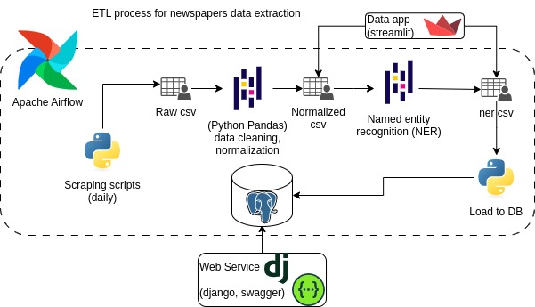

# Servicio web noticias periódicos

## Instalación
```
cd ws/
sudo apt install python3-dev libpq-dev

# crear entorno virtual
python3 -m venv venv
# activar
source venv/bin/activate

# instalar requerimientos
pip install -r requirements.txt

# ajustar valores de base de datos en ws/settings.py DATABASES

# ejecutar en modo desarrollo
python manage.py runserver
```

## Documentación OPEN API

Para ver cómo usar el servicio.

- [https://api.periodicos.rmgss.net/schema](https://api.periodicos.rmgss.net/schema)
- [openapi.yaml](openapi.yaml)

### Levantar openapi con swagger-ui

En el directorio raíz de este proyecto.

```
docker run --rm -p 8080:8080 -e 80 -e SWAGGER_JSON=/temp/openapi.json -v $(pwd):/temp swaggerapi/swagger-ui
```

- Deploy con gninx uwsgi
- Ajustar settings.py

## Sobre el proceso ETL

Este servicio usa los datos generados durante el proceso ETL



## Notas deploy

### postgres y debian

Para postgres 15 se pudo conectar a postgres modificando el password a algo mas seguro. Quizá por políticas de seguridad nuevas.

```
ALTER USER postgres WITH ENCRYPTED PASSWORD 'U1nP4as5-W@$ord';
```

Para que la búsqueda de texto funcione correctamente se debería tener la base de datos en Locale `ES_es.utf8` y este locale debería estar previamente instalado en el sistema. Se puede crear la BD con este locale con:

```
CREATE DATABASE periodicos LOCALE 'es_ES.utf8' LC_CTYPE 'es_ES.utf8' LC_COLLATE 'es_ES.utf8' TEMPLATE template0;
```

### Django + usgi + Nginx 

[Una forma de deployar](https://medium.com/all-about-django/deploying-django-applications-in-production-with-uwsgi-and-nginx-78aac8c0f735)

Pasos seguidos.

Instalar uwsgi a nivel de sistema `sudo apt install uwsgi`

Crear archivo `/etc/uwsgi/apps-enabled/ws-periodicos.ini`.

```
[uwsgi]
uid = usuario
gid = groupo
chdir = /path/al/proyecto/ws/ws/ws
home = /path/al/proyecto/ws/venv
module = ws.wsgi:application
env = DJANGO_SETTINGS_MODULE=ws.settings.production
master = true
processes = 2
socket = /run/uwsgi/periodicos-ws.sock
logto = /var/log/uwsgi/periodicos-ws.log
chown-socket = usuario:grupo
chmod-socket = 664
vacuum = true
plugins = python3
```

Crear enlace simbólico `sudo ln -sf /etc/uwsgi/apps-available/ws-periodicos.ini /etc/uwsgi/apps-enabled/`

Crear directorio para el socket:

```bash
cd /run/
sudo mkdir -p uwsgi
sudo chwon -R usuario:grupo uwsgi/
```

Iniciar el proceso con uwsgi.

```
sudo cd /etc/uwsgi/apps-available/
sudo uwsgi --ini ws-periodicos.ini

# Debería verse el proceso iniciado, si hay errors se puede ver en el archivo de logs 
# marcado en 'logto' del archivo .ini
```

Crear el archivo para nginx `/etc/nginx/conf.d/periodicos-ws.conf` con algo similar a:

```
server{
        server_name server_name;

       access_log /var/log/nginx/periodicos_ws.access.log;
       error_log  /var/log/nginx/periodicos_ws.error.log;

        location /api/ {
			# proxy pass para el proceso uwsgi
                include uwsgi_params;
                uwsgi_pass unix:/var/run/uwsgi/periodicos-ws.sock;
        }

        location /schema/ {
		         # para el esquema swagger (mas arriba)
                 proxy_pass http://localhost:8080/;
        }
```
Reinciar nginx

## Notas adicionales 

Ejecutar notebook desde cli con papermill:

```bash
papermill <Notebook> <ruta_salida>
```
Ejemplo:
```bash
cd notebooks/eledeber
papermill ./preprocessing.ipynb /tmp/papermill.ipynb

```
